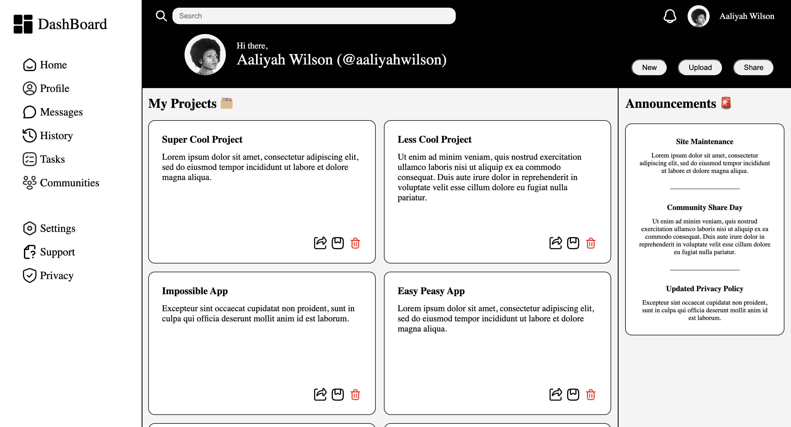

# 🖥️ Admin Dashboard Mockup

This project is a **mock admin dashboard** built as part of my CSS Grid practice. The primary goal is to use **CSS Grid** to create a structured, responsive layout — mimicking the kind of dashboard you'd see in a real-world web application.

---

## 📚 Project Context

> Now that I’ve had plenty of practice using Grid, I’m building a full dashboard design to put those skills to use. For this project, I’m leaning heavily on **CSS Grid** for layout work, while using minimal additional styling or tools.

---

## 🛠️ Built With

- **HTML5**
- **CSS3**
- **CSS Grid Layout**
- (Optional) Vanilla JavaScript _(if used)_
- (Optional) Icons via FontAwesome or similar _(if used)_

---

## 🎯 Features

- Responsive layout using **CSS Grid**
- Sidebar navigation
- Header with controls (search, user icon, etc.)
- Main content area with cards/widgets
- Simple, clean design to simulate an admin interface

---

## 📸 Screenshots



---

## 🚀 Getting Started

1. Clone the repository:
   ```bash
   git clone https://github.com/your-username/admin-dashboard.git
   ```
